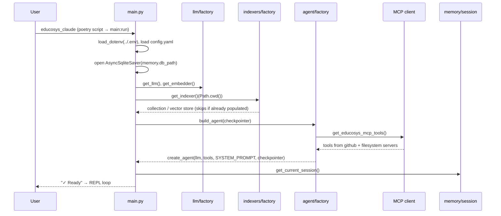
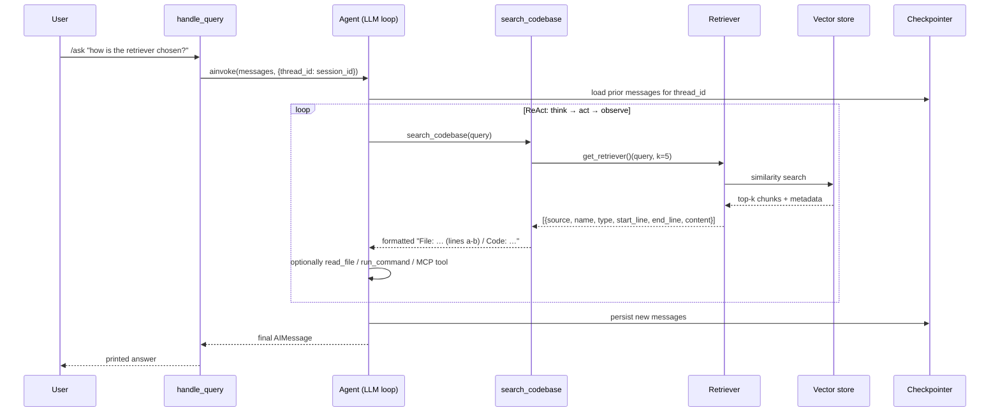
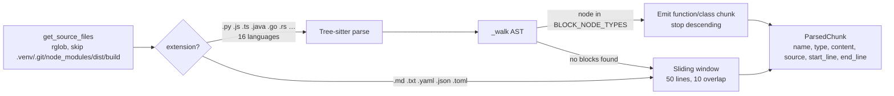
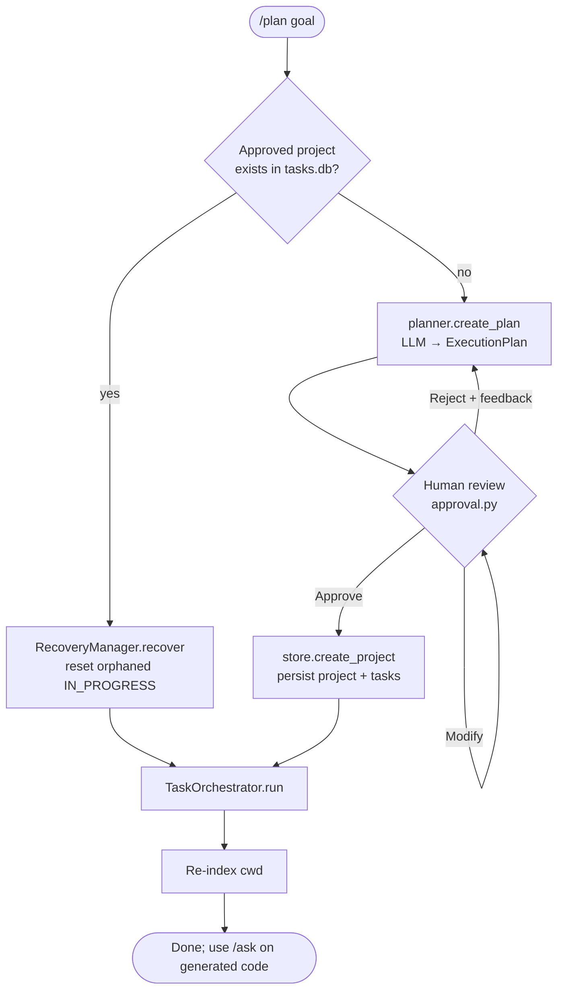
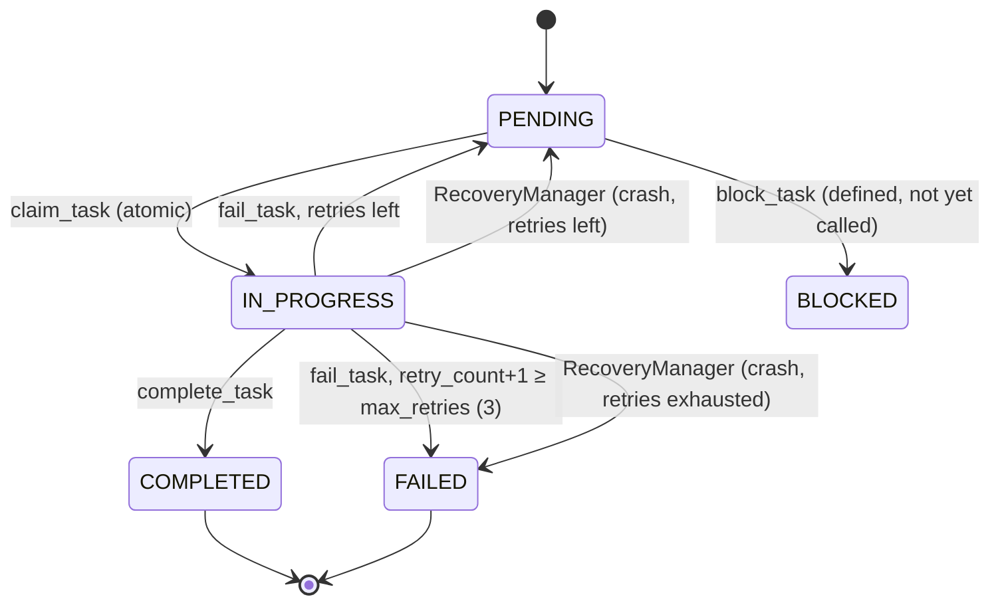

# Educosys Claude — Architecture

Educosys Claude is a terminal-based coding agent. It is launched from inside a target project and offers two modes of operation:

1. **Ask mode (`/ask`)**: a single ReAct-style LangChain agent answers questions about the codebase. It uses RAG over a vector index of the project, and it can read and write files, run shell commands, and call external MCP tools. Conversation memory persists across restarts.
2. **Plan mode (`/plan`)**: a planner → human approval → executor pipeline. An LLM breaks a goal into a DAG of tasks. A human approves or edits the plan. Each task then runs as its own short-lived sub-agent with least-privilege tools, and an LLM-as-judge checks every result. Task state lives in SQLite, so a crashed run can be resumed.

Both modes share one configuration system, one LLM/embedder factory layer, and one set of local tools.

---

## 1. System overview

```mermaid
flowchart TB
    User([Developer in terminal]) --> REPL[main.py<br/>Rich REPL + command router]

    subgraph Bootstrap
        CFG[config.py + config.yaml]
        ENV[.env]
        LLMF[llm/factory.py<br/>get_llm / get_embedder]
    end

    REPL -->|/ask| ASK[agent/orchestrator.py<br/>handle_query]
    REPL -->|/plan| PLAN[tasks/orchestrator.py<br/>handle_plan_command]
    REPL -->|/task_status| STATUS[tasks/status.py]
    REPL -->|/new_session /switch /session| SESS[memory/session.py]
    REPL -->|/show_index| IDXF

    ASK --> AGENT[LangChain agent<br/>agent/factory.py:build_agent]
    AGENT --> TOOLS
    AGENT <--> CKPT[(AsyncSqliteSaver<br/>conversation checkpoints)]

    subgraph TOOLS[Agent tools]
        T1[search_codebase<br/>agent/tools.py]
        T2[filesystem tools]
        T3[terminal tools]
        T4[MCP tools<br/>GitHub, filesystem]
    end

    T1 --> RETF[context/retrievers/factory.py]
    RETF --> VS[(Vector store<br/>Chroma / Qdrant)]
    IDXF[context/indexers/factory.py] --> PARSER[code_parser.py<br/>Tree-sitter + sliding window]
    PARSER --> VS
    T4 --> MCPC[mcp/educosys_mcp_client.py] --> MCPS[[npx MCP servers]]

    PLAN --> PLANNER[tasks/planner.py]
    PLAN --> APPROVAL[tasks/approval.py]
    PLAN --> TORCH[TaskOrchestrator]
    TORCH --> EXEC[tasks/executor.py<br/>sub-agent + LLM judge]
    TORCH <--> TSTORE[(SQLiteTaskStore<br/>tasks.db)]
    PLAN --> RECOV[tasks/recovery.py]
    RECOV --> TSTORE
    EXEC --> T2
    EXEC --> T3
    PLAN -->|re-index after run| IDXF
```



### Design principles visible in the code

| Principle | Where it shows up |
|---|---|
| **Config-driven factories** | `llm/factory.py`, `context/indexers/factory.py`, `context/retrievers/factory.py` choose implementations from `config.yaml`, with lazy imports so unused backends are never loaded. |
| **Tools return strings, not exceptions** | Every `@tool` in `tools/` and `skills/skill_tools.py` catches errors and returns `"Error: ..."` so the LLM can recover instead of crashing the loop. |
| **Least privilege per task** | `tasks/executor.py:_TOOLS_BY_TYPE` gives each task type only the tools it needs (for example, `review` cannot run commands). |
| **Durable state before action** | `SQLiteTaskStore` writes every state transition atomically before the orchestrator acts on it, which makes crash recovery possible. |
| **Progressive disclosure** | Skills put only their metadata in the system prompt and load full instructions on demand (see §7). |
| **Target project = `Path.cwd()`** | Indexing, skills discovery and `.educosys/` state all resolve relative to the directory the CLI is launched from. |

---

## 2. Package layout

```
educosys_claude/
├── main.py                    # Entry point: bootstrap + REPL command router
├── config.py / config.yaml    # Global settings dict
├── educosys_mcp_servers.json  # External MCP server definitions
│
├── llm/factory.py             # get_llm(), get_embedder()  (OpenAI | Anthropic | HuggingFace)
│
├── agent/                     # ── Ask mode ──
│   ├── factory.py             # build_agent(): LLM + tools + system prompt + checkpointer
│   ├── orchestrator.py        # handle_query(): invoke agent with thread_id
│   └── tools.py               # search_codebase  (RAG tool)
│
├── context/                   # ── RAG layer ──
│   ├── indexers/
│   │   ├── code_parser.py     # File discovery + Tree-sitter AST chunking
│   │   ├── factory.py         # get_indexer(), get_index_inspector()
│   │   ├── semantic_chroma.py # Dense index in local ChromaDB
│   │   ├── semantic_qdrant.py # Dense index in Qdrant
│   │   ├── hybrid_qdrant.py   # Dense + BM25 sparse index in Qdrant
│   │   └── watcher.py         # watchdog-based live re-indexing (not wired yet)
│   └── retrievers/
│       ├── factory.py         # get_retriever()
│       ├── semantic_chroma.py
│       ├── semantic_qdrant.py
│       └── hybrid_qdrant.py
│
├── tasks/                     # ── Plan mode ──
│   ├── planner.py             # LLM → structured ExecutionPlan (Pydantic)
│   ├── approval.py            # Human-in-the-loop approve / modify / reject
│   ├── orchestrator.py        # handle_plan_command(), TaskOrchestrator loop
│   ├── executor.py            # Per-task sub-agent + LLM-as-judge
│   ├── task_store.py          # SQLite persistence + task state machine
│   ├── recovery.py            # Reset orphaned IN_PROGRESS tasks after a crash
│   └── status.py              # /task_status table
│
├── tools/
│   ├── filesystem_tools.py    # read/write/append/delete/list/exists
│   └── terminal_tools.py      # run_command, run_in_directory (blocklist + 30s timeout)
│
├── mcp/
│   ├── educosys_mcp_config.py # Load JSON, expand ${ENV_VARS}
│   └── educosys_mcp_client.py # MultiServerMCPClient → LangChain tools
│
├── memory/
│   ├── session.py             # current session id file (thread_id)
│   └── short_term.py          # checkpointer path, summarization middleware
│
├── skills/
│   ├── registry.py            # SkillRegistry: discover & parse SKILL.md packages
│   └── skill_tools.py         # load_skill tool + build_skills_prompt()
│
└── observability/logger.py    # Root logger at WARNING, app loggers at DEBUG
```

---

## 3. Startup sequence



REPL commands routed in `main.py:_run_async`:

| Command | Handler |
|---|---|
| `/ask <question>` | `agent.orchestrator.handle_query` |
| `/plan <goal>` | `tasks.orchestrator.handle_plan_command` |
| `/task_status` | `tasks.status.show_task_status` |
| `/show_index` | `get_index_inspector()(index)` |
| `/new_session`, `/switch <id>`, `/session` | `memory.session` |
| `/exit`, `/quit` | leave loop, close checkpointer |

---

## 4. Ask mode: the RAG coding agent

### 4.1 Agent construction (`agent/factory.py`)

`build_agent()` calls `langchain.agents.create_agent` (a LangGraph-backed tool-calling loop) with:

- **Model**: `get_llm()`, which returns `ChatOpenAI` or `ChatAnthropic` depending on `llm.provider`.
- **System prompt**: a senior-engineer persona told to *always* call `search_codebase` first and to cite files, functions and line numbers.
- **Tools**: `search_codebase`, `run_command`, `run_in_directory`, `read_file`, `write_file`, `append_file`, `list_directory`, `file_exists`, plus every tool exposed by the configured MCP servers.
- **Checkpointer**: the `AsyncSqliteSaver` opened in `main.py`.

### 4.2 Query flow



Errors inside `handle_query` are caught and returned as `"Error: …"`, so a failed query never brings down the REPL.

### 4.3 Conversation memory (`memory/`)

- **Thread identity**: `session.py` stores the active session UUID in `<dir of memory.db_path>/current_session`. `/new_session` writes a fresh UUID. `/switch` overwrites the file with a given id.
- **History storage**: LangGraph's `AsyncSqliteSaver` keys checkpoints by `thread_id`, so switching sessions switches conversation history.
- **Summarization**: `short_term.get_summarization_middleware()` builds a `SummarizationMiddleware` (trigger at `summarize_at_tokens`, keep `keep_last_messages`), but `build_agent` does not pass it to `create_agent` yet. See §10.

---

## 5. RAG layer: indexing and retrieval

### 5.1 Chunking (`context/indexers/code_parser.py`)



Chunks follow semantic boundaries (whole top-level functions and classes) rather than arbitrary character windows. Nested functions stay inside their parent chunk, so nothing is indexed twice.

### 5.2 Backend selection

Both `get_indexer()` and `get_retriever()` apply the same rule, which keeps the indexer and retriever in sync:

| `rag.mode` | `vector_store.provider` | Implementation | Search type |
|---|---|---|---|
| `hybrid` | `qdrant` | `hybrid_qdrant` | Dense (OpenAI/HF embeddings) + sparse BM25 (`FastEmbedSparse("Qdrant/bm25")`); `vector_store.retrieval_mode` picks `dense` / `sparse` / `hybrid` |
| any other | `qdrant` | `semantic_qdrant` | Dense only (Qdrant Cloud via `QDRANT_URL` / `QDRANT_API_KEY`) |
| any other | anything else | `semantic_chroma` | Dense only, local `PersistentClient` at `chromadb.persist_dir` |

Every indexer skips work when the target collection already has points (it treats the index as a cache). Every retriever returns the same normalized dict shape, so `search_codebase` does not need to know which backend is active.

### 5.3 Index freshness

- At startup the index is built once and then reused.
- After `/plan` completes, `handle_plan_command` calls `get_indexer()(cwd)` again. Because indexers skip non-empty collections, that call **does not add the newly generated files** unless the collection is cleared first.
- `watcher.py` is meant to fix this: a `watchdog` observer (polling on Windows, native elsewhere) with a 1.5 s per-file debounce, calling `index_single_file` / `remove_file_from_index`. These functions are not yet implemented in `semantic_chroma.py`, and `start_watcher` is not called from `main.py`.

---

## 6. Plan mode: multi-agent task execution

### 6.1 End-to-end flow (`tasks/orchestrator.py:handle_plan_command`)



### 6.2 Planner (`tasks/planner.py`)

`create_agent(..., tools=[], response_format=ExecutionPlan)` forces structured output. The schema is:

- `ExecutionPlan`: `project_name`, `goal_summary`, `tech_stack`, `total_estimated_hours`, `tasks`, `risks`, `assumptions`
- `PlannedTask`: `id` (`task_001` …), `title`, `description`, `task_type` (`design|implement|test|review|integrate|configure`), `depends_on`, `estimated_minutes`, `output_files`, `acceptance_criteria`

The system prompt requires 5–20 tasks, a valid DAG, and 3–5 verifiable acceptance criteria per task. On rejection, the user's feedback goes back to the planner as `extra_context`.

### 6.3 Orchestrator loop (`TaskOrchestrator.run`)

```
while True:
    progress = store.get_progress(project)
    if pending == 0 and in_progress == 0:  → print summary, exit
    ready = store.get_ready_tasks(project)        # PENDING with all deps COMPLETED/SKIPPED
    if not ready:
        if in_progress: sleep 5s, continue
        else: warn "blocked by failed dependencies", exit
    gather(_execute(t) for t in ready[:max_concurrent])   # max_concurrent = 1 (serial)
```

`_execute(task)`:
1. `store.claim_task`: atomic `UPDATE … WHERE status='pending'`; returns False if another worker won.
2. `store.get_dep_results(depends_on)`: fetches the summaries of completed dependencies.
3. `run_subtask_agent(task, dep_outputs)`.
4. On success, `complete_task(result)`. On any exception (including a judge rejection), `fail_task(error)`.

### 6.4 Sub-agent executor (`tasks/executor.py`)

Each task gets a **fresh, stateless agent**. There is no shared checkpointer between tasks. Context passes between tasks in two ways: the files written to disk, and the dependency summaries injected into the prompt as `PRIOR TASK OUTPUTS`.

| `task_type` | Tools granted |
|---|---|
| `design` | read_file, write_file, list_directory |
| `implement` | read_file, write_file, append_file, list_directory |
| `test` | read_file, write_file, append_file, list_directory, **run_command** |
| `review` | read_file, write_file |
| `integrate` | read_file, write_file, append_file, list_directory, **run_command** |
| `configure` | read_file, write_file, list_directory, file_exists |

The executor streams the agent (`astream`, `stream_mode="values"`) and logs each tool call. It then takes the last non-empty `AIMessage` as the output, which handles reasoning models and Anthropic content-block lists.

**LLM-as-judge**: a second agent, `_judge_task`, uses the cheaper `llm.judge_model` with `response_format=_JudgeVerdict{passed, score, reason}`. It scores the output (first 2000 chars) against the acceptance criteria. If `passed` is false (score < 6), the executor raises `ValueError`, and that feeds straight into the store's retry logic.

### 6.5 Task state machine (`tasks/task_store.py`)



Persistence details:
- SQLite in **WAL mode**, with a new connection per operation (`_conn()` context manager: commit on success, rollback on error).
- Tables: `projects(id, name, goal, plan_json, status, …)` and `tasks(id, project_id, …, depends_on JSON, output_files JSON, acceptance_criteria JSON, result, error, retry_count, max_retries, execution_order, timestamps)`, indexed on `(project_id, status)`.
- Retry logic is a single SQL `CASE` inside `fail_task`, so the state transition stays atomic.

### 6.6 Crash recovery (`tasks/recovery.py`)

Execution is single-process and serial. Any task still `IN_PROGRESS` when `/plan` starts must therefore be an orphan from a dead process, so no heartbeat is needed. `recover()` sends such tasks back to `PENDING` (incrementing `retry_count`) or to `FAILED` once retries are exhausted. The orchestrator then resumes the loop.

---

## 7. Skills (progressive disclosure)

`skills/` implements an Anthropic-style skills system. Skills live in `<cwd>/.educosys/skills/<name>/SKILL.md`:

```
---
name: python_debug
description: Debug Python errors and tracebacks
when_to_use: error, traceback, exception
---
<full instructions…>
```

| Tier | What the LLM sees | When |
|---|---|---|
| 1 | `name: description \| when_to_use` for every skill | Always (appended to the system prompt by `build_skills_prompt()`) |
| 2 | Full `SKILL.md` body + list of support file paths | When the agent calls the `load_skill(name)` tool |
| 3 | Individual support files (`scripts/`, `templates/`, `resources/`) | When the agent calls `read_file` on them |

`get_registry()` is a lazy process-wide singleton, so `Path.cwd()` resolves to the target project. The registry and tool are complete, but **`agent/factory.py` does not yet register `load_skill` or append `build_skills_prompt()`** to `SYSTEM_PROMPT`.

---

## 8. Tool layer and safety

### Local tools (`tools/`)
- **Filesystem**: validate empty paths, existence and file-vs-directory; `read_file` caps files at 10 MB and requires UTF-8; `write_file` creates parent directories. `delete_file` exists but is deliberately left out of every agent's toolset.
- **Terminal**: `subprocess.run(shell=True)` with a 30 s timeout, combined stdout/stderr/exit-code output, and a substring blocklist (`rm -rf /`, `mkfs`, `dd if=`, fork bomb). The blocklist is a basic guard, not a sandbox, and the commands run with the user's own permissions.

### MCP tools (`mcp/`)
`educosys_mcp_servers.json` declares stdio servers launched via `npx`:
- `github`: `@modelcontextprotocol/server-github`, with `GITHUB_PERSONAL_ACCESS_TOKEN=${GITHUB_TOKEN}`
- `filesystem`: `@modelcontextprotocol/server-filesystem ${CWD}`

`load_educosys_mcp_configs()` expands `${VAR}` placeholders from the environment. `MultiServerMCPClient.get_tools()` turns each server's tools into LangChain tools, which are added to the Ask-mode agent. Node.js must be installed. Plan-mode sub-agents do **not** receive MCP tools.

---

## 9. Configuration and on-disk state

`config.yaml` (loaded once into the global `config` dict):

| Key | Purpose |
|---|---|
| `llm.provider`, `llm.model` | Main chat model (`openai:gpt-4o` by default) |
| `llm.judge_model` | Cheaper model for the LLM-as-judge (`gpt-4o-mini`) |
| `embeddings.provider`, `embeddings.model` | `openai` / `huggingface` embedding model |
| `rag.mode` | `semantic` \| `hybrid` |
| `vector_store.provider`, `.retrieval_mode` | `chroma` \| `qdrant`; `dense` \| `sparse` \| `hybrid` |
| `chromadb.persist_dir`, `.collection_name` | Local Chroma location |
| `qdrant.collection_name` | Qdrant collection |
| `memory.db_path`, `.summarize_at_tokens`, `.keep_last_messages` | Checkpointer DB + summarization settings |
| `tasks.db_path` | Plan-mode task DB |
| `skills.skills_dir` | Skills folder relative to cwd |

Environment (`capstone_project/.env`): `OPENAI_API_KEY` / `ANTHROPIC_API_KEY`, `QDRANT_URL`, `QDRANT_API_KEY`, `GITHUB_TOKEN`, `CWD`.

Runtime state created under the launch directory:

```
.educosys/
├── memory/memory.db        # LangGraph conversation checkpoints
├── memory/current_session  # active thread_id
├── chromadb/               # local vector index (Chroma backend)
├── tasks.db                # projects + tasks (Plan mode)
└── skills/                 # user-provided SKILL.md packages
```

---

## 10. Implementation status and known gaps

| Area | Status |
|---|---|
| Ask-mode agent, RAG (Chroma / Qdrant / hybrid), MCP, sessions | Wired and working |
| Plan mode: planner, approval, orchestrator, executor, judge, retries, recovery | Wired and working |
| Skills registry + `load_skill` tool | Implemented; **not registered** in `build_agent` |
| Summarization middleware | Implemented; **not passed** to `create_agent` |
| Live re-indexing (`watcher.py`) | Implemented; depends on missing `semantic_chroma.index_single_file` / `remove_file_from_index`; `watchdog` is not in `pyproject.toml`; not started from `main.py` |
| Re-index after `/plan` | Runs, but indexers skip non-empty collections, so new files are not added |
| `BLOCKED` status | `block_task` exists but is never called; tasks whose deps fail stay `PENDING`, and the loop exits with a warning |
| Project lifecycle | Projects are never marked complete, so `get_latest_approved_project()` makes every later `/plan <new goal>` resume the previous project instead of planning the new goal |
| `config.yaml` | `vector_store` key is declared twice; YAML keeps the last one, which drops `retrieval_mode` (harmless with Chroma, matters for hybrid Qdrant) |
| Concurrency | `max_concurrent=1`; the atomic claim already supports raising it |
